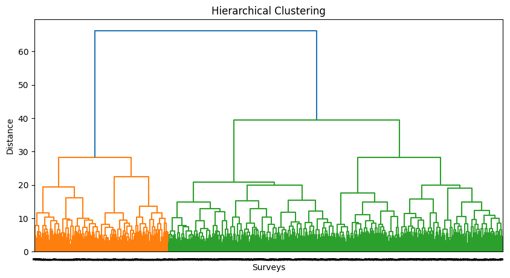

## Table of Contents
- [Introduction and Background](#introduction-and-background)
- [Problem Definition](#problem-definition)
- [Methods](#methods)
  - [Data Preprocessing](#data-preprocessing)
  - [ML Algorithms and Models](#ml-algorithms-and-models)
- [Quantitative Metrics](#quantitative-metrics)
- [Data Preprocessing](#data-preprocessing)
  - [Synthetic Minority Oversampling Technique (SMOTE)](#synthetic-minority-oversampling-technique-smote)
  - [Multiple Correspondence Analysis (MCA)](#multiple-correspondence-analysis-mca)
- [Results and Discussion](#results-and-discussion)
  - [Hierarchical Clustering](#hierarchical-clustering)
  - [Logistic Regression](#logistic-regression)
  - [Support Vector Machine (SVM)](#support-vector-machine-svm)
  - [Random Forest](#random-forest)
- [Conclusion and Future Steps](#conclusion-and-future-steps)
  - [Expected Results and Final Conclusions](#expected-results-and-final-conclusions)
  - [Future Steps](#future-steps)
- [References](#references)
- [Additional Submission Requirements](#additional-submission-requirements)
  - [Gantt Chart](#gantt-chart)
  - [Proposal Video Presentation](#proposal-video-presentation)
  - [Project Award Eligibility](#project-award-eligibility)

# Introduction and Background

## Literature Review
With its outbreak in March 2020 and millions of cases, the COVID-19 pandemic prompted public health measures like social distancing and mask mandates [2]. Research shows that adherence to these policies is shaped by individual perceptions of COVID-19 severity and personal risk [2]. While studies have examined the links between socioeconomic status, disease transmission, and risk behaviors, little research has explored how personal financial circumstances influence perceptions of illnesses like COVID-19 [3]. Preliminary findings suggest financial anxiety heightens psychological distress related to the virus, while financial preparedness may reduce urgency to follow social distancing guidelines [2,3]. Financial constraints may shape beliefs about personal infection risk and virus spread, potentially more than expected factors like political partisanship or local case severity [1,3].

## Dataset Description and Link
To explore this relationship, we analyze data from [Harvard’s A Survey on Health Care Access During the COVID-19 Pandemic](https://dataverse.harvard.edu/dataset.xhtml?persistentId=doi:10.7910/DVN/XCKM0V) (June 2020). This dataset includes responses on health care access, financial situations, public health policy views, and COVID-19 perceptions.

# Problem Definition

## Problem
While individual perceptions of COVID-19 severity influence adherence to public health measures, little research has explored how personal financial factors—such as income, employment stability, and health insurance status—shape these beliefs [2,3]. Our project will use classification models on the survey data to determine whether financial status is predictive of individual attitudes toward COVID-19.

## Motivation
Understanding this relationship is crucial for refining public health messaging, improving outreach strategies, and optimizing resource allocation. Economic burdens and disparities in healthcare coverage may directly influence compliance with preventive measures, making it essential to tailor interventions accordingly [2]. Insights from this analysis could enhance pandemic preparedness efforts, ensuring financial constraints are considered in response strategies [2].

# Methods

## Data Preprocessing
**One-Hot Encoding**
- What & Why: One-hot encoding is used to convert categorical variables into a numerical form. It creates binary columns for each category, removing any ordinality in the data. This is necessary because machine learning algorithms generally require numerical input and cannot handle categorical variables directly without assuming any inherent ranking or order between categories, which could introduce bias. For example, if a survey question provides multiple options for financial status (e.g., “employed”, “unemployed”, “student”), one-hot encoding transforms these options into separate columns, each representing a choice with a binary value (1 for selected, 0 for not selected).
- How: We used Pandas to apply one-hot encoding, editing the survey data manually where appropriate by assigning columns for possible responses. For example, when encoding birth year data, we grouped respondents into age categories based on their age in 2021 (e.g., “teenager,” “adult,” “senior”) to reduce the number of unique values. This preprocessing helped ensure the data was transformed into a numerical format compatible with machine learning models.

**Multiple Correspondence Analysis (MCA)**
- What & Why: MCA is a dimensionality reduction technique, similar to PCA, but better suited for categorical data. We used MCA because our raw data had 84 initial features and only 1211 rows of data, and having so many features with relatively few samples could lead to overfitting. Similarly, after applying SMOTE, we still had 84 features but now 1947 rows of data, creating a comparable issue. Applying MCA enables us to reduce the number of features while maintaining a significant portion of the original variance, which makes the model more generalizable and avoids overfitting without losing too much information.
- How: We applied MCA using the mca.MCA function from the Python MCA package. For the raw dataset (n = 1211), we reduced 84 features to 11 components, preserving 75% of the original variance and satisfying the 10x rule (at least 10 samples per feature). These components were interpretable and allowed us to visualize feature groupings using bar plots and heatmaps, which helped us link top components back to meaningful survey variables. We then applied the same approach to the SMOTE-balanced dataset (n = 1947) to explore how MCA would perform on synthetic data. We generated two reduced versions: one with 9 components preserving 75% of variance to mirror the raw data, and another with 36 components preserving 95% of variance to test whether higher information retention improved model performance. Visualizations were omitted for the SMOTE sets, since exploratory data analysis was less relevant for synthetic samples. Still, using multiple MCA-reduced datasets allowed us to compare model outcomes across different feature sets and identify tradeoffs between interpretability and performance.

**Synthetic Minority Oversampling Technique (SMOTE)**
- What & Why: SMOTE is a technique used to generate synthetic examples for underrepresented classes by creating new data points along the lines connecting existing minority class neighbors. We used SMOTE because our target variable (COVID-19 concern) had a severe class imbalance: the majority of responses fell into the “Somewhat Worried” category, while the “Not Worried” and “Very Worried” classes were significantly smaller. This imbalance risked biasing the model toward the majority class and reducing its ability to accurately classify minority categories. By applying SMOTE, we aimed to create a more balanced dataset, enabling the model to learn more evenly across all levels of COVID-19 concern and improve generalizability.
- How: We used the SMOTE function from the imblearn.over_sampling Python package to oversample the two minority classes in the training set. This increased our sample size from 1211 to 1947, with each class now equally represented. This balanced dataset was then used as input for both our baseline and MCA-reduced models to evaluate how class balancing affected model performance.

## ML Algorithms and Models
**Hierarchical Clustering**
- What & Why: Hierarchical clustering is an unsupervised learning technique that groups data points based on similarity, producing a tree-like structure called a dendrogram. Although our target variable has three predefined labels, this method helps us explore whether the data naturally clusters into three distinct groups, as expected, or whether there are more or fewer groupings. By identifying the potential number of natural clusters that emerge, we can gain insights into how individuals’ financial circumstances correlate with their perception of COVID-19 and better understand the separability or overlap between the groups. This can help inform future decisions for data preprocessing, feature engineering, or model selection/design.
- How: We used the scipy.cluster.hierarchy package to apply hierarchical clustering and visualize the results with a dendrogram. This was done on the raw dataset (84 features), the raw MCA-reduced dataset (11 components, 75% variance) and the SMOTE-balanced MCA dataset (9 components, also preserving 75% variance). In all cases, we “cut” the resulting dendrogram into three clusters, given we have three expected perception classes (not worried, somewhat worried, or very worried about COVID-19). Comparing cluster structure across the datasets helped us assess the extent of class separability present in the natural data and how both feature reduction and synthetic balancing may have influenced underlying data patterns.

**Logistic Regression**
- What & Why: Logistic regression is a simple and effective classification algorithm that models the probability of an event occurring using the sigmoid function. We chose logistic regression as a starting point due to its simplicity and training speed, making it a good baseline model for comparison with more complex methods. It is particularly useful for multi-class classification and also provides interpretable coefficients, helping us understand the impact of each feature on the final prediction. 
- How: We implemented logistic regression using the SGDClassifier model from sklearn.linear_model with a 'log_loss' setting to support multi-class classification. The model was trained across all five dataset versions: the raw data, MCA-reduced raw data, SMOTE-balanced data, and two MCA-reduced SMOTE datasets (preserving 75% and 95% variance, respectively). For each input, the model generated class probabilities, with the final prediction corresponding to the category with the highest probability. This setup allowed us to evaluate logistic regression’s performance as a simple baseline across varying data structures.

**Support Vector Machine (SVM)**
- What & Why: SVM is a powerful classifier that finds the hyperplane that best separates the classes in high-dimensional spaces. We chose SVM because it performs well with high-dimensional data and complex feature spaces. SVM maximizes the margin between classes, which helps with generalization, especially in cases like ours where there might be complex decision boundaries due to diverse perceptions of COVID-19. Additionally, SVM is robust to overfitting, which is important given our limited sample size, and it can be regularized if necessary to improve performance.
- How: We implemented SVM using the sklearn.svm.SVC function and trained it across five different versions of the dataset: the raw data, MCA-reduced raw data, SMOTE-balanced data, and two MCA-reduced SMOTE datasets (preserving 75% and 95% variance, respectively). In addition to classification, we used SVM in conjunction with permutation importance on the MCA-reduced raw dataset to identify which components most influenced predictive accuracy. This analysis helped us trace back key components to original survey features and better understand which financial and healthcare factors most impacted COVID-19 perception.
  
**Random Forest**
- What & Why: Random Forest is a supervised ensemble learning method that aggregates predictions from multiple decision trees to improve accuracy and reduce overfitting. It excels at capturing nonlinear relationships and interactions in high-dimensional data, which is valuable for modeling complex datasets like ours, where COVID-19 perceptions may be shaped by many interacting factors. Additionally, Random Forest models can provide estimates of feature importance, offering interpretability by highlighting which variables most influence predictions.
- How: We implemented Random Forest using sklearn.ensemble.RandomForestClassifier and trained it on all five datasets: the raw data, MCA-reduced raw data, SMOTE-balanced data, and two MCA-reduced SMOTE datasets (preserving 75% and 95% variance, respectively). For each input, the model generated class probabilities by averaging predictions across the ensemble of decision trees. We also extracted three example cases to build a visualization tool that displays prediction probabilities alongside each person’s profile, helping us interpret how different features may drive the model’s decisions. This approach allowed us to evaluate performance across different data structures and gain additional insight through the model’s internal feature importance metrics.

# Quantitative Metrics 
**Hierarchical Clustering**
- Silhouette Score: Measures how well each data point fits within its cluster (cohesion) and how distinct the clusters are from each other (separation). Ranges from [-1, 1], where a score of 1 indicates well-separated clusters with strong cohesion, and a score closer to -1 suggests poor clustering. 
- Davies-Bouldin Score: Evaluates the average similarity between clusters by assessing intra-cluster compactness and inter-cluster separation. A score of 0 means perfect separation, and <1 is ideal.
- Fowlkes-Mallows Score: Assesses the similarity between true labels and clustering results. Ranges from [0, 1], where a score closer to 1 suggests better alignment.
- Adjusted Random Index: Evaluates the similarity between two clusters. Ranges from [-1,1], where 1 means perfect dissimilarity between clusters and -1 indicating extremely poor separation likely caused by extremely poor labeling. 

**Logistic Regression, SVM, and Random Forest**
- F1: Captures both the model’s ability to predict classes correctly and avoid missing instances that should have been classified by calculating the harmonic mean of precision and recall. Ranges from 0 to 1, with 1 being perfect and 0 indicating no correct classifications. 2 * ((Precision * Recall) / (Precision + Recall))
    - Precision: Gives the proportion of true positives to the amount of total positives the model predicts. TP/(TP + FP) 
    - Recall: Gives the proportion of true positive predictions from all actual positive samples in the dataset. TP/(TP + FN)
    - Macro F1 Avg. vs. Weighted F1 Avg.: The weighted average represents a way to account for class imbalances that may skew the macro average, potentially offering a more balanced view of the model’s performance.
- AUC-ROC (Area Under the Receiver Operating Characteristic Curve): Measures how well the model distinguishes between classes across all possible thresholds. 
    - ROC Curves: ROC curves visualize results by showing the trade-offs between the True Positive Rate (TPR) and False Positive Rate (FPR) for each class. Curves further from the diagonal (at 0.5 AUC, representing random guessing) indicate better performance. 
    - AUC: Provides a single scalar value representing the model’s overall ability to distinguish between classes. Ranges from [0, 1], with a score closer to 1 indicating good quality of classification.
    - Macro-AUC vs Micro-AUC: Micro aggregates the contributions of all classes and treats each instance equally, potentially providing a clearer picture of overall performance compared to macro, especially in the presence of class imbalances. 
- Accuracy: Reflects the overall percentage of correct predictions. (TP + TN) / (TP + FP + TN + FN)

# Data Preprocessing 

## Synthetic Minority Oversampling Technique (SMOTE) 

We used the imblearn.over_sampling.SMOTE method to balance the dataset by generating synthetic samples for underrepresented classes. This was necessary because exploration of our data and initial results revealed our target variable was heavily imbalanced, with the majority of respondents falling in the "Somewhat Worried" class Without balancing, models could become biased toward this dominant class and perform poorly on minority categories (i.e, "Not Worried" and "Very Worried"). SMOTE helped ensure that all perception categories were better represented during training, improving model fairness, generalizability, and performance.

## Multiple Correspondence Analysis (MCA)

Given our raw data began with 84 features and only 1211 samples, we chose to apply the mca.MCA method to the preprocessed dataset to reduce dimensionality and identify underlying patterns in the categorical data. The following scree plot was generated to visualize how much variance is captured by each MCA component, helping us evaluate how effectively the transformation summarizes the original data:

As expected, the first 10–15 components capture the majority of the variance in our dataset, as shown in the scree plot. To determine how many components to retain, we experimented with different variance thresholds and ultimately chose to preserve 75% of the total variance because this threshold corresponds to retaining 11 MCA components, adhering to the 10x rule, which recommends having at least 10 times as many data samples as features – in our case, with roughly 1,200 samples, 11 features was a suitable upper limit. This choice aims to provide a strong balance between preserving informative structure in the data while reducing feature dimensionality. 

We repeated this same transformation on the SMOTE-balanced dataset (n = 1,947) to ensure consistent preprocessing across datasets. For the SMOTE version, we generated two reduced versions: one preserving 75% variance (9 components) to match the raw configuration, and another preserving 95% variance (36 components) to evaluate the impact of higher information retention on model performance.

Note that the visualizations that follow (i.e., the heatmaps and bar charts) were generated only for the raw dataset. Since the SMOTE datasets consist of synthetic samples, and our focus at that stage was on modeling rather than further exploratory analysis, we chose to omit visualizations for those versions; including them could potentially highlight artificial patterns or redundancies that do not reflect real-world insights. Instead, we limited exploratory visualizations to the raw dataset, where the MCA outputs were grounded in real responses and could be used later to trace model behavior back to original survey features.

The following heat map was generated to interpret the correlations between each MCA component and the original feature set:

As indicated by the legend, darker red values represent strong positive correlations between features and MCA components, while darker blue values indicate strong negative correlations. Given the large number of features (84) we filtered the heatmap to show only the top two and bottom two contributing features for each MCA component. This helped improve readability and allowed us to focus on the most impactful relationships without overwhelming the visualization.

Lastly, we also plotted bar charts for each MCA component, highlighting the top five contributing features. This was done to better visualize which original survey variables had the greatest influence on each component. In the figure, red bars represent positive contributions and blue bars represent negative contributions, consistent with the color scheme used in the earlier heatmap.

On their own, these visualizations simply reveal how features group within components, which offers limited insight. However, our intention was to revisit these graphs after identifying which MCA components significantly impacted model performance. This allowed us to trace meaningful model behavior back to real-world features. For example, we expand on the interpretation of specific components in depth within our SVM analysis below.

# Results and Discussion

## Hierarchical Clustering 

To explore potential groupings within the data, we applied hierarchical clustering to identify natural clusters based on respondents’ financial circumstances and their perception of COVID-19. We performed the clustering on the raw dataset (84 features), the raw MCA-reduced dataset (11 components, 75% variance) and the SMOTE-balanced MCA dataset (9 components, also preserving 75% variance) and then evaluated the results using common clustering metrics. We used the ward linkage method and investigated two-clusterings and three-clusterings. The dendrograms for each of these three analyses are shown below.

### Analysis: Clustering and Separability Metrics ###

Below are the dendrograms for the raw data, SMOTE data, and SMOTE + MCA 75% data, respectively. Note that the overall structure of the dendrograms did not change drastically. 

#### Raw Data
 
#### SMOTE Data
 
#### SMOTE + MCA Data

Based on the dendrograms, we observed that the strongest natural groupings seem to fall into either two or three clusters. We compare the Silhouette Score, Davies-Bouldin Score, Fowlkes-Mallows Score, and Adjusted Random Index of all five models below to identify how different preprocessing methods impacted the clusterings and determine the best performing models. 

<table cellspacing="0" cellpadding="6" style="border-collapse: collapse; width: 100%;">
  <thead>
    <tr>
      <th rowspan="2" style="border-bottom: 3px solid black; border-right: 3px solid black;">Metric</th>
      <th colspan="5" style="border-bottom: 2px solid black;">k = 2</th>
      <th colspan="5" style="border-left: 3px solid black; border-bottom: 2px solid black;">k = 3</th>
    </tr>
    <tr>
      <th>Raw</th>
      <th>MCA (75%)</th>
      <th>SMOTE</th>
      <th>SMOTE + MCA (75%)</th>
      <th style="border-right: 3px solid black;">SMOTE + MCA (95%)</th>
      <th>Raw</th>
      <th>MCA (75%)</th>
      <th>SMOTE</th>
      <th>SMOTE + MCA (75%)</th>
      <th>SMOTE + MCA (95%)</th>
    </tr>
  </thead>
  <tbody>
    <tr>
      <td style="border-right: 3px solid black; border-top: 3px solid black;">Silhouette Score</td>
      <td style="border-top: 3px solid black;">0.0837</td>
      <td style="border-top: 3px solid black;">0.293</td>
      <td style="border-top: 3px solid black;">0.123</td>
      <td style="border-top: 3px solid black;">0.319</td>
      <td style="border-right: 3px solid black; border-top: 3px solid black;">0.242</td>
      <td style="border-top: 3px solid black;">0.0728</td>
      <td style="border-top: 3px solid black;">0.214</td>
      <td style="border-top: 3px solid black;">0.0684</td>
      <td style="border-top: 3px solid black;">0.217</td>
      <td style="border-top: 3px solid black;">0.175</td>
    </tr>
    <tr>
      <td style="border-right: 3px solid black;">Davies-Bouldin Score</td>
      <td>3.096</td>
      <td>1.189</td>
      <td>2.603</td>
      <td>1.131</td>
      <td style="border-right: 3px solid black;">1.474</td>
      <td>3.597</td>
      <td>1.526</td>
      <td>3.674</td>
      <td>1.512</td>
      <td>1.547</td>
    </tr>
    <tr>
      <td style="border-right: 3px solid black;">Fowlkes-Mallows Score</td>
      <td>0.4597</td>
      <td>0.483</td>
      <td>0.481</td>
      <td>0.0455</td>
      <td style="border-right: 3px solid black;">0.452</td>
      <td>0.392</td>
      <td>0.385</td>
      <td>0.378</td>
      <td>0.368</td>
      <td>0.410</td>
    </tr>
    <tr>
      <td style="border-right: 3px solid black;">Adjusted Random Index</td>
      <td>0.0227</td>
      <td>0.0227</td>
      <td>0.0622</td>
      <td>0.0356</td>
      <td style="border-right: 3px solid black;">0.0587</td>
      <td>0.0260</td>
      <td>0.0312</td>
      <td>0.0656</td>
      <td>0.0480</td>
      <td>0.0667</td>
    </tr>
  </tbody>
</table>

Our Silhouette Score for two clusters and three clusters was 0.0837 and 0.0728, respectively. Such low Silhouette Scores indicate extremely weak clustering (although k=2 was marginally better), suggesting that the data may more naturally divide into two groups rather than three. For k=2, the Davies-Bouldin score was 3.096, indicating decent compactness. When k=3, there was marginally worse cluster separation at 3.597. The Fowlkes-Mallows score, which measures similarity between clusters, was at 0.459 for k=2 but 0.385 for k=3. As the score for k=2 is closer to 1 (ideal for Fowlkes-Mallows), again we see that our assumed clustering of datapoints into three distinct worry levels may actually be more overlapping than expected.

Such poor clustering could be due to too few samples, reducing the model’s ability to establish clear relationships within the data or poor feature selection, limiting the model’s ability to differentiate between groups. We further explored these potential causes by performing SMOTE and MCA on our data. With SMOTE, we found that the two-cluster model’s performance improved whereas the three-cluster model performed worse. The three-cluster model likely performed worse because SMOTE introduced noise to already noisy data, while two-clustering likely performed better with SMOTE because SMOTE filled in the gaps in the data. However, it is worth pointing out that with SMOTE, the Adjusted Random Index was better for k=3, suggesting that, despite the clustering being better in k=2, points were incorrectly clustered. 

We also performed MCA to investigate if it was the number of features that was negatively impacting clustering. We found that for both k=2 and k=3, MCA substantially improved performance. This is likely due to the fact that MCA removed noise from the data, making it easier to cluster. The accuracy of the predictions, in particular, was much higher, although it is worth pointing out that compactness decreased, indicating that even though performance improved, our data points generally do not strongly cluster together well. 

### Analysis: t-SNE and UMAP 

To investigate whether the three worry‑level classes form coherent geometric clusters after dimensionality reduction and, in turn, to understand the poor performance of hierarchical clustering reported above, we performed t-SNE and UMAP analysis.

#### Results

<table cellspacing="0" cellpadding="6" style="border-collapse: collapse; margin-left: auto; margin-right: auto;">
  <thead>
    <tr style="border-bottom: 3px solid black;">
      <th style="text-align: left; border-right: 3px solid black;">Embedding Method</th>
      <th style="text-align: left;">Silhouette Score</th>
    </tr>
  </thead>
  <tbody>
    <tr>
      <td style="border-right: 3px solid black;">t-SNE (75% variance)</td>
      <td>-0.0203</td>
    </tr>
    <tr>
      <td style="border-right: 3px solid black;">t-SNE (95% variance)</td>
      <td>-0.0172</td>
    </tr>
    <tr>
      <td style="border-right: 3px solid black;">UMAP (75% variance)</td>
      <td>-0.0237</td>
    </tr>
    <tr>
      <td style="border-right: 3px solid black;">UMAP (95% variance)</td>
      <td>-0.0194</td>
    </tr>
  </tbody>
</table>

#### t-SNE on MCA (75% variance)

#### UMAP on MCA (75% variance)

The figures above show the corresponding scatter plots; colors denote “Not Worried," “Somewhat Worried," and “Very Worried” respondents.

No visually distinct regions appear for any class. Quantitatively, both embeddings yield negative silhouette values, indicating that, on average, observations lie closer to members of other classes than to members of their own class.

The absence of separable structure in both t‑SNE and UMAP projections suggests that the worry labels do not correspond to latent clusters in the underlying feature space after capturing 75% of categorical variance. Additional experiments retaining 95% variance (images not shown, but data included above) produced similarly negative silhouettes, confirming that the remaining 20% of inertia still consists largely of noise with respect to class separability.

This finding explains the weak dendrogram partitions obtained with agglomerative clustering: the data simply lack geometric cohesion along the worry dimension. Consequently, subsequent analyses focus on supervised techniques that can exploit subtle, high‑dimensional boundaries rather than expecting unsupervised algorithms to recover distinct groups.

### Conclusion 

Overall we found that a combination of SMOTE and MCA performed the best because SMOTE filled gaps in the data, improving the clustering of minority classes while MCA removed noise from the data making the points easier to cluster. However, across all models, the clustering was not very strong possibly because there is nonlinearity in the data. To further explore this, we ran the data on models that are suitable for non-linear data and, in fact, found that those models performed better. 

## Logistic Regression 

As a baseline supervised model, we implemented logistic regression on all five versions of our dataset: the raw data, MCA-reduced raw data, SMOTE-balanced data, and two MCA-reduced SMOTE datasets (preserving 75% and 95% of the original variance, respectively). In all cases, we trained a logistic regression classifier using the SGDClassifier model from sklearn.linear_model, with a 'log_loss' setting to support multi-class classification. The dataset was split into a 60% training / 40% testing split using train_test_split from sklearn.model_selection. We used the SGDClassifier instead of traditional LogisticRegression to manually control learning dynamics and simulate a training loop. We chose a low learning rate (learning_rate = "constant" and eta0 = 0.0001), high max iterations (max_iter = 1000), and tight convergence tolerance (tol = 1e-10, max_iter = 1000) to promote gradual, stable learning and closely monitor convergence behavior over time.

### Analysis of Standard Metrics on All Models ###

All models were evaluated using the standard accuracy metrics and ROC-AUC curves to assess performance on the test set, the results of which are shown below.

#### Accuracy and AUC-ROC Metrics

<table cellspacing="0" cellpadding="6" style="border-collapse: collapse; margin-left: auto; margin-right: auto;">
  <thead>
    <tr style="border-bottom: 3px solid black;">
      <th style="text-align: left; border-right: 3px solid black;">Metric</th>
      <th>Raw</th>
      <th>Raw MCA (75% Variance)</th>
      <th>SMOTE</th>
      <th>SMOTE MCA 0.75</th>
      <th>SMOTE MCA 0.95</th>
    </tr>
  </thead>
  <tbody>
    <tr>
      <td style="font-weight: bold; border-right: 3px solid black;">Accuracy</td>
      <td>0.60</td><td>0.56</td><td>0.63</td><td>0.51</td><td>0.55</td>
    </tr>
    <tr style="border-bottom: 2px solid #444;">
      <td style="font-weight: bold; border-right: 3px solid black;">Predictions with &gt;50% Confidence</td>
      <td>0.77</td><td>0.66</td><td>0.71</td><td>0.34</td><td>0.31</td>
    </tr>
    <tr>
      <td style="border-right: 3px solid black;">Not Worried AUC</td>
      <td>0.63</td><td>0.64</td><td>0.82</td><td>0.69</td><td>0.71</td>
    </tr>
    <tr>
      <td style="border-right: 3px solid black;">Somewhat Worried AUC</td>
      <td>0.67</td><td>0.66</td><td>0.79</td><td>0.71</td><td>0.74</td>
    </tr>
    <tr style="border-bottom: 1.5px solid #aaa;">
      <td style="border-right: 3px solid black;">Very Worried AUC</td>
      <td>0.71</td><td>0.66</td><td>0.82</td><td>0.66</td><td>0.71</td>
    </tr>
    <tr>
      <td style="font-weight: bold; border-right: 3px solid black;">Macro Avg. AUC</td>
      <td>0.69</td><td>0.67</td><td>0.79</td><td>0.69</td><td>0.72</td>
    </tr>
    <tr>
      <td style="font-weight: bold; border-right: 3px solid black;">Micro Avg. AUC</td>
      <td>0.76</td><td>0.74</td><td>0.81</td><td>0.69</td><td>0.72</td>
    </tr>
  </tbody>
</table>

#### Class-Wise Precision, Recall, and F1 Scores

<table cellspacing="0" cellpadding="6" style="border-collapse: collapse; margin-left: auto; margin-right: auto;">
  <thead>
    <tr style="border-bottom: 3px solid black;">
      <th style="border-right: 3px solid black;">Class</th>
      <th>Metric</th>
      <th>Raw</th>
      <th>Raw MCA</th>
      <th>SMOTE</th>
      <th>SMOTE MCA (75%)</th>
      <th>SMOTE MCA (95%)</th>
    </tr>
  </thead>
  <tbody>
    <tr>
      <td rowspan="3" style="border-right: 3px solid black;">Not Worried</td>
      <td>Precision</td><td>0.49</td><td>0.00</td><td>0.68</td><td>0.55</td><td>0.61</td>
    </tr>
    <tr><td>Recall</td><td>0.33</td><td>0.00</td><td>0.62</td><td>0.53</td><td>0.56</td></tr>
    <tr><td>F1</td><td>0.40</td><td>0.00</td><td>0.65</td><td>0.54</td><td>0.58</td></tr>

    <tr>
      <td rowspan="3" style="border-right: 3px solid black;">Somewhat Worried</td>
      <td>Precision</td><td>0.64</td><td>0.56</td><td>0.63</td><td>0.50</td><td>0.51</td>
    </tr>
    <tr><td>Recall</td><td>0.85</td><td>0.99</td><td>0.63</td><td>0.34</td><td>0.38</td></tr>
    <tr><td>F1</td><td>0.73</td><td>0.72</td><td>0.63</td><td>0.41</td><td>0.44</td></tr>

    <tr>
      <td rowspan="3" style="border-right: 3px solid black;">Very Worried</td>
      <td>Precision</td><td>0.51</td><td>0.40</td><td>0.60</td><td>0.50</td><td>0.52</td>
    </tr>
    <tr><td>Recall</td><td>0.26</td><td>0.02</td><td>0.64</td><td>0.67</td><td>0.69</td></tr>
    <tr><td>F1</td><td>0.34</td><td>0.03</td><td>0.62</td><td>0.57</td><td>0.59</td></tr>

    <tr style="border-top: 2px solid #444;">
      <td rowspan="3" style="border-right: 3px solid black;">Macro Avg.</td>
      <td>Precision</td><td>0.55</td><td>0.48</td><td>0.63</td><td>0.51</td><td>0.55</td>
    </tr>
    <tr><td>Recall</td><td>0.48</td><td>0.34</td><td>0.63</td><td>0.51</td><td>0.54</td></tr>
    <tr><td>F1</td><td>0.49</td><td>0.25</td><td>0.63</td><td>0.50</td><td>0.54</td></tr>

    <tr>
      <td rowspan="3" style="border-right: 3px solid black;">Weighted Avg.</td>
      <td>Precision</td><td>0.58</td><td>0.60</td><td>0.64</td><td>0.51</td><td>0.55</td>
    </tr>
    <tr><td>Recall</td><td>0.60</td><td>0.56</td><td>0.63</td><td>0.51</td><td>0.55</td></tr>
    <tr><td>F1</td><td>0.57</td><td>0.41</td><td>0.63</td><td>0.50</td><td>0.54</td></tr>
  </tbody>
</table>

We found that the worst performing model was SMOTE + MCA with 75% variance preserved, possibly because MCA introduced more complexity into the data that the model was not able to comprehend. The best performing model was SMOTE, giving 63% accuracy. This model performed the best likely because SMOTE balanced the data and allowed for better generalizability in minority classes. To further prove this point, if we compare the models that ran on raw data and SMOTE data, we see that SMOTE drastically improved performance across all metrics particularly for the minority classes (Not Worried and Very Worried). 

Examining the AUC-ROC curves of the worst and best models (below), we see that in comparison to the SMOTE + 75% MCA models, the curves in the SMOTE model notably shift outward, meaning that SMOTE logistic regression is better at distinguishing false positives from true positives across all categories. However for both the best and worst performing models, the AUC-ROC curves are far from ideal, suggesting that logistic regression may not be the most optimal classifier for our data. 

This is further supported by the fact that the loss curves (shown below) plateaued early on in training despite training the models on 1000 epochs. The models are unable to fully learn from the data even with sufficient time, indicating that the data has a nonlinear and nonseparable nature.

### Conclusion 

As a result, while logistic regression served as a baseline model, it highlighted the need for more robust classifiers like SVM or Random Forest which are better suited for data with complex relationships. It also highlighted that although COVID greatly impacted individuals’ personal finances, there is a complex relationship between insurance and personal finance circumstances and attitude towards the coronavirus pandemic.

## Support Vector Machine (SVM)

As our second supervised model to classify respondents’ perception of COVID-19, we implemented SVM classifiers (from the sklearn.svm library, using the SVC model) on five versions of our dataset: the full raw data, MCA-reduced raw data, SMOTE-balanced data, and two MCA-reduced SMOTE datasets (preserving 75% and 95% of the original variance, respectively). For each dataset, we split the data into 80% training and 20% testing sets using train_test_split from sklearn.model_selection. For hyperparameter optimization, we used GridSearchCV, which exhaustively searches all combinations of hyperparameter values and selects the best one based on accuracy. This was done using 5-fold cross-validation, where the model is trained on 4 subsets and tested on the remaining 1, ensuring generalization and reducing overfitting. We optimized the C parameter, which controls model complexity, and gamma, which defines the influence of training points, both of which were tuned for the Radial Basis Function (RBF) kernel, chosen for its effectiveness in handling non-linear data.

### Analysis of Standard Metrics on All Models

All models were evaluated using standard accuracy metrics and ROC-AUC curves to assess performance on the test set, the results of which are shown below.

#### Accuracy and AUC-ROC Metrics

<table cellspacing="0" cellpadding="6" style="border-collapse: collapse; margin-left: auto; margin-right: auto;">
  <thead>
    <tr style="border-bottom: 3px solid black;">
      <th style="border-right: 3px solid black;">Metric</th>
      <th>Raw</th>
      <th>Raw MCA</th>
      <th>SMOTE</th>
      <th>SMOTE MCA 0.75</th>
      <th>SMOTE MCA 0.95</th>
    </tr>
  </thead>
  <tbody>
    <tr style="border-bottom: 2px solid #444;">
      <td style="border-right: 3px solid black;"><strong>Accuracy</strong></td>
      <td>0.56</td><td>0.58</td><td>0.68</td><td>0.59</td><td>0.66</td>
    </tr>
    <tr>
      <td style="border-right: 3px solid black;">Not Worried AUC</td>
      <td>0.74</td><td>0.76</td><td>0.90</td><td>0.79</td><td>0.88</td>
    </tr>
    <tr>
      <td style="border-right: 3px solid black;">Somewhat Worried AUC</td>
      <td>0.69</td><td>0.68</td><td>0.85</td><td>0.77</td><td>0.84</td>
    </tr>
    <tr>
      <td style="border-right: 3px solid black;">Very Worried AUC</td>
      <td>0.61</td><td>0.65</td><td>0.82</td><td>0.76</td><td>0.76</td>
    </tr>
    <tr style="border-top: 1.5px solid #ccc;">
      <td style="border-right: 3px solid black;"><strong>Macro Avg. AUC</strong></td>
      <td>0.67</td><td>0.69</td><td>0.86</td><td>0.77</td><td>0.82</td>
    </tr>
    <tr>
      <td style="border-right: 3px solid black;"><strong>Micro Avg. AUC</strong></td>
      <td>0.76</td><td>0.77</td><td>0.87</td><td>0.78</td><td>0.83</td>
    </tr>
  </tbody>
</table>

#### Class-Wise Precision, Recall, and F1 Scores

<table cellspacing="0" cellpadding="6" style="border-collapse: collapse; margin-left: auto; margin-right: auto;">
  <thead>
    <tr style="border-bottom: 4px solid black;">
      <th style="text-align: left; border-right: 3px solid black;">Class</th>
      <th style="text-align: left;">Metric</th>
      <th>Raw</th>
      <th>Raw MCA</th>
      <th>SMOTE</th>
      <th>SMOTE MCA 75%</th>
      <th>SMOTE MCA 95%</th>
    </tr>
  </thead>
  <tbody>

    <!-- Not Worried -->
    <tr><td rowspan="3" style="border-right: 3px solid black;">Not Worried</td><td>Precision</td><td>0.71</td><td>0.65</td><td>0.80</td><td>0.74</td><td>0.74</td></tr>
    <tr><td>Recall</td><td>0.24</td><td>0.22</td><td>0.71</td><td>0.55</td><td>0.70</td></tr>
    <tr><td>F1</td><td>0.35</td><td>0.33</td><td>0.75</td><td>0.63</td><td>0.72</td></tr>

    <!-- Somewhat Worried -->
    <tr style="border-top: 2px solid black;"><td rowspan="3" style="border-right: 3px solid black;">Somewhat Worried</td><td>Precision</td><td>0.39</td><td>0.61</td><td>0.75</td><td>0.58</td><td>0.70</td></tr>
    <tr><td>Recall</td><td>0.12</td><td>0.17</td><td>0.59</td><td>0.64</td><td>0.69</td></tr>
    <tr><td>F1</td><td>0.18</td><td>0.27</td><td>0.66</td><td>0.61</td><td>0.70</td></tr>

    <!-- Very Worried -->
    <tr style="border-top: 2px solid black;"><td rowspan="3" style="border-right: 3px solid black;">Very Worried</td><td>Precision</td><td>0.57</td><td>0.58</td><td>0.57</td><td>0.52</td><td>0.58</td></tr>
    <tr><td>Recall</td><td>0.90</td><td>0.92</td><td>0.75</td><td>0.60</td><td>0.62</td></tr>
    <tr><td>F1</td><td>0.70</td><td>0.71</td><td>0.65</td><td>0.56</td><td>0.59</td></tr>

    <!-- Macro Avg -->
    <tr style="border-top: 3px solid black; font-weight: bold;"><td rowspan="3" style="border-right: 3px solid black;">Macro Avg.</td><td>Precision</td><td>0.56</td><td>0.61</td><td>0.71</td><td>0.61</td><td>0.67</td></tr>
    <tr style="font-weight: bold;"><td>Recall</td><td>0.42</td><td>0.44</td><td>0.68</td><td>0.59</td><td>0.67</td></tr>
    <tr style="font-weight: bold;"><td>F1</td><td>0.41</td><td>0.44</td><td>0.69</td><td>0.60</td><td>0.67</td></tr>

    <!-- Weighted Avg -->
    <tr style="border-top: 2px solid black; font-weight: bold;"><td rowspan="3" style="border-right: 3px solid black;">Weighted Avg.</td><td>Precision</td><td>0.55</td><td>0.60</td><td>0.71</td><td>0.61</td><td>0.67</td></tr>
    <tr style="font-weight: bold;"><td>Recall</td><td>0.57</td><td>0.58</td><td>0.68</td><td>0.59</td><td>0.67</td></tr>
    <tr style="font-weight: bold;"><td>F1</td><td>0.50</td><td>0.52</td><td>0.69</td><td>0.60</td><td>0.67</td></tr>

  </tbody>
</table>

The worst performing SVM was the one trained on raw data, likely due to poor class balance leading the model to favor the majority class and produce very low recall and F1 scores for two of the classes. The best performing SVM was the one trained on SMOTE‑resampled data, likely because oversampling the minority classes balanced the training set, allowing the SVM to learn more representative decision boundaries and so achieving the highest macro AUC. We did not pursue the Raw MCA or SMOTE+MCA variants further, as MCA dimensionality reduction proved ineffective on our complex dataset (regardless of percentage preserved variance), indicating that collapsing features removed variance necessary to separate overlapping classes.

In the evaluation, the SVM model trained on the raw dataset was the least effective. It achieved an accuracy of 56%, a macro‑averaged precision of 56%, a macro‑averaged recall of 42%, and a macro‑averaged F1‑score of 41%. By contrast, the SVM trained on SMOTE data was the top performer, reaching 68% accuracy, 71% macro‑precision, 68% macro‑recall, and 69% macro‑F1. These changes correspond to absolute gains of 12 percentage points in accuracy, 15 in precision, 26 in recall, and 28 in F1‑score. Improvements like these highlight the importance of addressing class imbalance. Oversampling the minority classes with SMOTE helped the SVM learn more balanced decision boundaries, which in turn boosted its ability to detect under‑represented categories. For these reasons, we will concentrate our further analysis on the raw and SMOTE SVM models to explore the trade offs between simplicity and balanced classification.

Comparing the two plots, using the raw data, each curve stays close to the diagonal and rises only slowly. For example, the “Very Worried” class, we see an AUC of about 0.61, barely above random. In the SMOTE‑resampled chart, however, all three curves sweep decisively toward the top left corner. Now, “Very Worried” reaches an AUC of approximately 0.82, “Somewhat Worried” about 0.85, and “Not Worried” nearly 0.90. The shift shows that oversampling the minority classes helped the SVM learn much sharper decision boundaries, producing higher true‑positive rates at every false positive level. We also compared the overall multi‑class ROC performance: the macro AUC rose from 0.68 on the raw data to 0.86 with SMOTE, and every class curve shifts notably toward that top left region. This confirms that balancing the minority classes dramatically improved the SVM’s ability to distinguish between all three worry levels.

### Permutation Importance of MCA Components

To better interpret the importance of individual features in the SVM model, we performed a permutation importance analysis on the MCA components. This method involved shuffling each MCA component one at a time and assessing the impact on model accuracy. The components that, when shuffled, caused a significant drop in accuracy are considered highly influential to the SVM’s decision-making process. The visual result of this analysis is shown below:

Evidently, X1 and X2 showed the largest drops in accuracy, indicating they were the most important components for the model’s predictions. On the other hand, X3 and X10 exhibited smaller or even negative drops, implying that they may have a minimal impact on the model or might even hinder performance slightly, potentially indicating less relevance or redundancy.

To understand what these MCA components represent in terms of the original features, we can return to our examination of the top 5 contributing features for each component. For the purpose of the following analysis, we focus on only the top 3.
- X1 was the most influential component for the classifier. It was strongly characterized by an inverse relationship with being a child, and direct relationships with being pregnant and having recently accessed food from a soup kitchen. This suggests that higher X1 scores may reflect individuals who are likely adults and experiencing some degree of economic hardship or vulnerability. The contrast between being not a child and being in a caregiving or financially stressed position likely creates a clear profile associated with higher concern about COVID-19 – possibly explaining X1’s strong predictive power.
- X2 was also among the most important components. It was shaped by inverse relationships with having no opinion on both personal and general healthcare affordability, and a direct relationship with being a senior. In other words, higher X2 values may represent older individuals with more clearly formed opinions about healthcare access – a profile that may align with heightened COVID-19 risk and awareness. The combination of age and healthcare engagement likely makes this profile very informative for distinguishing between worry levels.
- X3 also had limited predictive value. It was shaped by inverse relationships with losing health insurance due to job loss and having someone close lose a job – features that would typically signal personal financial disruption. It also included a direct relationship with having no opinion on general healthcare affordability – a direction opposite to what was observed in X2. This combination suggests that higher X3 values may represent individuals who are both economically stable and disengaged from broader healthcare policy. Because this profile lacks clear indicators of vulnerability or concern, it may offer little information relevant to differentiating COVID-19 perception levels – hence its weak impact on the model’s performance.
- X10 was among the least impactful components in the model. It was shaped by an inverse relationship with working more hours since the start of the COVID crisis, a direct relationship with Medicare as a primary source of health coverage, and an inverse relationship with Medicare plus a supplemental plan or Medicare Advantage. These features reflect both economic and healthcare-related experiences—such as not experiencing increased work demands and relying on basic government-supported insurance without additional coverage. This combination may signal relative financial and healthcare stability, rather than heightened vulnerability or concern, which makes it less informative in predicting levels of COVID-19 perception. The absence of a strong or distinctive signal likely explains X10’s limited contribution to the SVM model’s predictive performance.
​​

In summary, this analysis of MCA component importance highlights which latent feature combinations are most predictive of COVID-19 perception and which contribute little or introduce noise. Components like X1 and X2 captured clear, interpretable profiles – such as older individuals with healthcare concerns or economically vulnerable adults – that aligned with strong model performance. In contrast, X3 and X10 included overlapping but ambiguously combined features that lacked clear directional signals, limiting their utility. For future explorations of this topic, these insights could help inform feature engineering and dimensionality reduction decisions.

### Conclusion

Compared with models like logistic regression, the SVM consistently outperformed on both the raw and SMOTE datasets. Likely from handling complex, high‑dimensional feature interactions and benefiting from margin‑based regularization to guard against overfitting. Many values of recall and precision for individual worry levels remain only moderate, so there is still room to boost our model’s sensitivity and specificity. Moving forward, we plan to investigate ensemble techniques like Random Forest to capture additional non‑linear patterns and further boost robustness.

## Random Forest

As our third supervised model to classify respondents’ perception of COVID-19, we implemented Random Forest classifiers across five different versions of our dataset: the raw data, MCA-transformed raw data (75% variance), SMOTE-balanced data, and two MCA-reduced SMOTE datasets (preserving 75% and 95% of the variance, respectively). The Random Forest classifier (from the sklearn.ensemble library, using the RandomForestClassifier model) was trained on an 80/20 split of each dataset using train_test_split from sklearn.model_selection. To optimize performance, we used GridSearchCV with 5-fold cross-validation to tune hyperparameters. Specifically, we searched over the number of trees (n_estimators), tree depth (max_depth), and minimum samples required to split a node (min_samples_split). These parameters were chosen for their direct impact on model accuracy.

### Analysis of Standard Metrics on All Models ###

All models were evaluated using standard accuracy metrics and ROC-AUC curves to assess performance on the test set, the results of which are shown below.

#### Accuracy and AUC-ROC Metrics

<table cellspacing="0" cellpadding="6" style="border-collapse: collapse; margin-left: auto; margin-right: auto;">
  <thead>
    <tr style="border-bottom: 3px solid black;">
      <th style="text-align: left; border-right: 3px solid black;">Metric</th>
      <th>Raw</th>
      <th>Raw MCA (75%)</th>
      <th>SMOTE</th>
      <th>SMOTE MCA (95%)</th>
    </tr>
  </thead>
  <tbody>
    <tr style="border-bottom: 2px solid black;">
      <td style="border-right: 3px solid black;">Accuracy</td>
      <td>0.5802</td>
      <td>0.6091</td>
      <td>0.7282</td>
      <td>0.6795</td>
    </tr>
    <tr>
      <td style="border-right: 3px solid black;">Not Worried AUC</td>
      <td>0.73</td>
      <td>0.62</td>
      <td>0.93</td>
      <td>0.87</td>
    </tr>
    <tr>
      <td style="border-right: 3px solid black;">Somewhat Worried AUC</td>
      <td>0.62</td>
      <td>0.62</td>
      <td>0.88</td>
      <td>0.83</td>
    </tr>
    <tr style="border-bottom: 1.5px solid black;">
      <td style="border-right: 3px solid black;">Very Worried AUC</td>
      <td>0.70</td>
      <td>0.74</td>
      <td>0.88</td>
      <td>0.86</td>
    </tr>
    <tr>
      <td style="border-right: 3px solid black;">Micro Avg. AUC</td>
      <td>0.77</td>
      <td>0.75</td>
      <td>0.90</td>
      <td>0.85</td>
    </tr>
    <tr>
      <td style="border-right: 3px solid black;">Macro Avg. AUC</td>
      <td>0.68</td>
      <td>0.66</td>
      <td>0.90</td>
      <td>0.85</td>
    </tr>
  </tbody>
</table>

#### Class-Wise Precision, Recall, and F1 Scores

<table cellspacing="0" cellpadding="6" border="1" style="border-collapse: collapse;">
  <thead>
    <tr>
      <th>Class</th>
      <th>Metric</th>
      <th>Raw</th>
      <th>Raw MCA</th>
      <th>SMOTE</th>
      <th>SMOTE MCA (75%)</th>
      <th>SMOTE MCA (95%)</th>
    </tr>
  </thead>
  <tbody>
    <tr style="border-top: 2px solid black;">
      <td rowspan="3">Not Worried</td>
      <td>Precision</td>
      <td>0.75</td>
      <td>0.54</td>
      <td>0.84</td>
      <td>0.73</td>
      <td>0.84</td>
    </tr>
    <tr>
      <td>Recall</td>
      <td>0.17</td>
      <td>0.24</td>
      <td>0.76</td>
      <td>0.58</td>
      <td>0.65</td>
    </tr>
    <tr>
      <td>F1</td>
      <td>0.27</td>
      <td>0.33</td>
      <td>0.80</td>
      <td>0.64</td>
      <td>0.73</td>
    </tr>

    <tr style="border-top: 2px solid black;">
      <td rowspan="3">Somewhat Worried</td>
      <td>Precision</td>
      <td>0.59</td>
      <td>0.63</td>
      <td>0.72</td>
      <td>0.58</td>
      <td>0.63</td>
    </tr>
    <tr>
      <td>Recall</td>
      <td>0.90</td>
      <td>0.87</td>
      <td>0.64</td>
      <td>0.54</td>
      <td>0.70</td>
    </tr>
    <tr>
      <td>F1</td>
      <td>0.71</td>
      <td>0.73</td>
      <td>0.67</td>
      <td>0.56</td>
      <td>0.66</td>
    </tr>

    <tr style="border-top: 2px solid black;">
      <td rowspan="3">Very Worried</td>
      <td>Precision</td>
      <td>0.41</td>
      <td>0.52</td>
      <td>0.65</td>
      <td>0.56</td>
      <td>0.61</td>
    </tr>
    <tr>
      <td>Recall</td>
      <td>0.17</td>
      <td>0.31</td>
      <td>0.79</td>
      <td>0.73</td>
      <td>0.69</td>
    </tr>
    <tr>
      <td>F1</td>
      <td>0.24</td>
      <td>0.39</td>
      <td>0.71</td>
      <td>0.63</td>
      <td>0.65</td>
    </tr>

    <tr style="border-top: 4px solid black;">
      <td rowspan="3">Macro Avg.</td>
      <td>Precision</td>
      <td>0.58</td>
      <td>0.56</td>
      <td>0.73</td>
      <td>0.62</td>
      <td>0.69</td>
    </tr>
    <tr>
      <td>Recall</td>
      <td>0.41</td>
      <td>0.47</td>
      <td>0.73</td>
      <td>0.62</td>
      <td>0.68</td>
    </tr>
    <tr>
      <td>F1</td>
      <td>0.41</td>
      <td>0.48</td>
      <td>0.73</td>
      <td>0.61</td>
      <td>0.68</td>
    </tr>

    <tr style="border-top: 2px solid black;">
      <td rowspan="3">Weighted Avg.</td>
      <td>Precision</td>
      <td>0.59</td>
      <td>0.59</td>
      <td>0.74</td>
      <td>0.63</td>
      <td>0.70</td>
    </tr>
    <tr>
      <td>Recall</td>
      <td>0.58</td>
      <td>0.61</td>
      <td>0.73</td>
      <td>0.61</td>
      <td>0.68</td>
    </tr>
    <tr>
      <td>F1</td>
      <td>0.51</td>
      <td>0.57</td>
      <td>0.73</td>
      <td>0.61</td>
      <td>0.68</td>
    </tr>
  </tbody>
</table>

The worst performing model was the one trained on the original dataset, most likely due to poor class balance. The best performing model was the one trained on the SMOTE augmented dataset, likely because of the class balancing properties of SMOTE. Contrary to our original hypothesis, using MCA dimensionality reduction did not improve performance. This is likely because the dataset contains too many complex relationships, and therefore all of the variance is needed in order to train a model effectively. 

In the evaluation, the RandomForest model trained on the raw dataset was the least effective. It achieved an accuracy of 58%, a macro‑averaged precision of 58%, a macro‑averaged recall of 41%, and a macro‑averaged F1‑score of 41%. By contrast, the RandomForest trained on SMOTE data was the top performer, reaching 72.8% accuracy, 73% macro‑precision, 73% macro‑recall, and 73% macro‑F1. These changes correspond to absolute gains of 14.8 percentage points in accuracy, 32 in precision, 32 in recall, and 32 in F1‑score. Improvements like these highlight the importance of addressing class imbalance. Oversampling the minority classes with SMOTE helped the RandomForest learn more balanced decision boundaries, which in turn boosted its ability to detect under‑represented categories. For these reasons, we will concentrate our further analysis on the raw and SMOTE RandomForest models to explore the trade offs between simplicity and balanced classification.

Comparing the two plots, using the raw data, each curve stays close to the diagonal and rises only slowly, staying very close to random. In the SMOTE‑resampled chart, however, all three curves sweep decisively toward the top left corner: “Very Worried” reaches an AUC of approximately 0.88, “Somewhat Worried” about 0.88, and “Not Worried” nearly 0.93. The shift shows that oversampling the minority classes helped the RandomForest learn much sharper decision boundaries, producing higher true‑positive rates at every false positive level. This confirms that balancing the minority classes dramatically improved the Random Forest’s ability to distinguish between all three worry levels.

<!-- HTML Prediction Viewer-->
<h3>Prediction Viewer</h3>

Here, we include a prediction viewer representing three distinct samples from out testing set and the probabilities generated by our best-performing RandomForest model.

<!-- Center Body -->

  <!-- Dropdown -->
  <select id="profileSelect" onchange="updateProfile()" style="padding: 6px; font-size: 16px;">
    <option value="0">Wealthy, employer-insured, received stimulus and unemployment (Not Worried)</option>
    <option value="2">Young, lost job and insurance, received stimulus and subsidized plan (Somewhat Worried)</option>
    <option value="8">Low-income, on Medicaid, received no stimulus, meal insecure (Very Worried)</option>
  </select>

  <!-- Chart image, centered below dropdown -->
  

    
  

  <!-- Text profile, also centered -->
  

    This sample represents a wealthy, middle-aged individual with employer-sponsored insurance and high satisfaction with healthcare affordability. Though they were furloughed, they received both a government check and unemployment benefits, and have access to food assistance, which likely offsets economic concerns.
  

<!-- Script -->

# Conclusion and Future Steps

## Expected Results and Final Conclusions
Initially, we expected that individuals who are more financially stable would be less likely to worry about the virus, and that those with insurance would be less likely to adhere to safety guidelines; however, our conclusions suggest that the relationship between financial circumstances and attitudes toward COVID-19 may be more complex. While personal financial situations do play a role, attitudes are shaped by a variety of intersecting factors, highlighting the need for a more nuanced understanding of public health behavior.

## Future Steps

Several extensions of this project could take place to enhance both model performance and interpretability:
- Logistic Regression Tuning: We could conduct cross‑validation over a grid of learning rates and epoch counts to optimize training dynamics. Additionally, we could test multiple penalty terms (e.g., L1, L2, ElasticNet) to attempt to regularize the model appropriately for this high-dimensional, categorical setting.
- Random Forest Variants: We could explore more randomized ensemble approaches such as ExtraTreesClassifier to reduce overfitting and improve generalization, particularly when handling noisy or correlated input variables.
- Additional Model Families: We could experiment with gradient boosting methods (e.g., XGBoost, LightGBM), neural networks (if data volume supports), and ensemble stacking to better capture nonlinear interactions that may underlie complex attitude formation.
- Dataset Expansion: We could incorporate external data sources – such as regional, behavioral, or environmental indicators – to test whether broader contextual features improve prediction of COVID‑19 attitudes and reduce latent biases.

# References

[1] E. Díaz McConnell, C. M. Sheehan, and A. Lopez, “An intersectional and social determinants of health framework for understanding Latinx psychological distress in 2020: Disentangling the effects of immigration policy and practices, the Trump Administration, and COVID-19-specific factors,” Journal of Latinx Psychology, vol. 11, no. 1, pp. 1–20, 2023.

[2] D. Warmath, G. E. O’Connor, C. Newmeyer, and N. Wong, “Have I saved enough to social distance? The role of household financial preparedness in public health respgit puonse,” J. Consum. Aff., vol. 56, no. 1, pp. 319–338, 2022.

[3] J. S. Trueblood, A. B. Sussman, D. O’Leary, and W. R. Holmes, “Financial constraint and perceptions of COVID-19,” Sci. Rep., vol. 13, no. 1, p. 3432, 2023.

# Additional Submission Requirements

| Name   | Contribution                                                                 |
|--------|-----------------------------------------------------------------------------|
| Smera  | Data Preparation (SMOTE), Logistic Regression Implementation/Visuals/Analysis, SVM Visuals/Analysis, Random Forest Visuals, Presentation and Report |
| Riya   | Hierarchical Clustering Implementation/Visuals/Analysis, Logistic Regression Implementation/Visuals/Analysis, Presentation and Report |
| Neeti  | Data Preparation (MCA), Random Forest Implementation/Visuals/Analysis, Presentation and Report |
| Alex   | Data Preparation (OHE), tSNE/UMAP Implementation/Visuals/Analysis, Presentation and Report |
| Vedika | Data Preparation (OHE), SVM Implementation/Visuals/Analysis, Presentation and Report |

## Gantt Chart

For a closer look at our Gantt Chart, please visit our [Gantt Chart](https://docs.google.com/spreadsheets/d/1E1p70RDD56d0I94hZAmpB6Yi8sk8Odf7/edit?usp=sharing&ouid=103694429117780372609&rtpof=true&sd=true)
.

## Proposal Video Presentation
You can view our proposal's video presentation on [YouTube](https://youtu.be/MDyM2xItiBo). Our proposal presentation is also available on [Google Slides](https://docs.google.com/presentation/d/1B2bkujqyc6Nb2YeeNmBzmpjJ3HGh5ZLjmKWzUqO1b1s/edit?usp=sharing).

## Project Award Eligibility
We would like to be considered. 
